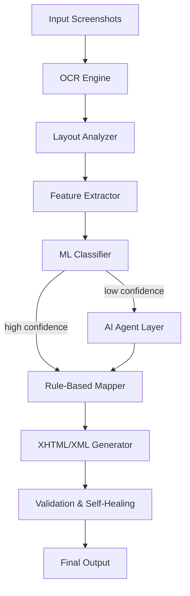

# Software Requirements Specification (SRS)
## Fully Autonomous Screenshot-to-XHTML/XML Automation System

---

## 1. Abstract

This document defines the Software Requirements Specification (SRS) for a **fully autonomous AI-driven system** that converts document screenshots into **client-compliant XHTML and XML** without any human interaction. The system is intended for high-volume publishing and content-production environments where accuracy, consistency, speed, and scalability are critical. All decisions—from layout understanding to final markup validation—are performed by automated components and AI agents.

---

## 2. Problem Statement

Manual or semi-automated conversion of screenshots into XHTML/XML is inefficient, error-prone, and does not scale. Existing rule-based systems fail on layout variations, noisy OCR, and complex document structures. Organizational management requires a **zero-human-intervention system** that can reliably produce production-ready markup directly from screenshots.

---

## 3. Existing System

- Screenshot-based input
- OCR-based text extraction
- Fixed rule-based layout interpretation
- Direct XHTML/XML generation

The system depends heavily on rigid rules and manual correction.

---

## 4. Drawbacks of Existing System

1. Sensitive to OCR errors
2. Rigid rules fail on layout variation
3. No contextual understanding
4. Difficult to maintain for multiple clients
5. Requires human review and correction
6. Not scalable for large volumes

---

## 5. Proposed System (Target State)

A **fully autonomous hybrid AI system** combining OCR, layout analysis, machine learning classification, rule-based formatting, and AI agents for reasoning and self-correction. The system operates end-to-end without any human approval, review, or interaction.

Key principles:
- Zero human intervention
- Deterministic output
- Client-configurable formatting
- Self-healing validation

---

## 6. Functional Overview – How the System Works

1. Screenshots are ingested automatically
2. OCR extracts text and spatial data
3. Layout blocks are detected
4. Features are extracted per block
5. ML classifier predicts semantic block type
6. Confidence scoring is applied
7. AI agents resolve ambiguity
8. Rules map block types to XHTML/XML
9. Output is validated and auto-repaired
10. Final client-ready markup is produced

---

## 7. System Architecture

### 7.1 Logical Architecture



---

## 8. Detailed Module Specifications (Implementation-Ready)

### 8.1 Input Management Module

**Purpose:** Automatically ingest screenshots

**Responsibilities:**
- Accept PNG/JPG/TIFF
- Enforce naming conventions
- Trigger processing pipeline

**Output:** Job-based image batches

---

### 8.2 OCR Processing Module

**Purpose:** Extract text with spatial metadata

**Output Format:**
```json
{ "text": "Sample", "bbox": [x1,y1,x2,y2], "confidence": 0.93 }
```

---

### 8.3 Layout Analysis Module

**Purpose:** Convert OCR lines into logical blocks

**Techniques:**
- Spatial clustering
- Column detection
- Line grouping

---

### 8.4 Feature Extraction Module

**Purpose:** Generate ML-ready features

**Features:**
- Relative font size
- Bold/italic flags
- Indentation
- Block dimensions
- Position on page
- Text patterns
- Previous block context

---

### 8.5 ML Classification Module

**Purpose:** Predict semantic block type

**Block Types:**
- chapter_title
- section_title
- paragraph
- list_item
- table
- figure_caption
- footnote

**Output:**
```json
{ "type": "section_title", "confidence": 0.84 }
```

---

### 8.6 AI Agent Orchestration Layer

**Purpose:** Replace all human decision-making

**Agents:**
1. Layout Reasoning Agent
2. Structural Consistency Agent
3. Repair & Validation Agent

**Decision Strategy:**
- Single-agent decision for medium ambiguity
- Multi-agent consensus for low confidence

---

### 8.7 Rule-Based Mapping Module

**Purpose:** Convert block types into client-specific markup

**Rules Source:** YAML / JSON

**Example:**
```yaml
section_title:
  tag: h2
  class: sec-title
```

---

### 8.8 XHTML/XML Generation Module

**Purpose:** Generate standards-compliant output

**Standards:**
- XHTML 1.1 / EPUB 3
- Client XML schemas

---

### 8.9 Validation & Self-Healing Module

**Purpose:** Ensure correctness without humans

**Capabilities:**
- Auto-fix nesting
- Auto-generate missing IDs
- Retry until valid

---

## 9. Data Flow (End-to-End)

```
Input → OCR → Layout → Features → ML
          ↓ (low confidence)
       AI Agents
          ↓
       Rules → Generate → Validate → Output
```

---

## 10. Technology Stack

- OCR: Tesseract / PaddleOCR
- Image Processing: OpenCV
- Backend: Python
- ML: Scikit-learn / LightGBM
- AI Agents: LLM (local or controlled API)
- Config: YAML / JSON
- Output: XHTML / XML

---

## 11. Deployment Model

- Fully automated batch pipeline
- Local or server-based execution
- No UI dependency

---

## 12. Time to Build (Estimated)

| Phase | Duration |
|------|----------|
| Design & setup | 1 week |
| OCR & layout | 1 week |
| Feature & ML | 2 weeks |
| AI agents | 2 weeks |
| Integration & testing | 2 weeks |

**Total:** ~8 weeks

---

## 13. Estimated Development Cost (Employees Only)

| Role | Duration |
|-----|----------|
| Python Engineer | 2 months |
| ML Engineer | 2 months |
| AI Engineer | 1.5 months |

*Infrastructure and licensing excluded*

---

## 14. Risks & Mitigation

| Risk | Mitigation |
|-----|-----------|
| Poor OCR quality | Image pre-processing |
| Layout diversity | ML + AI agents |
| Client changes | Config-driven rules |

---

## 15. Conclusion

This SRS defines a **clean, complete, and fully autonomous system** capable of converting screenshots into production-ready XHTML/XML without human involvement. The document is intended to be **directly usable by development teams** as a single source of truth for implementation.

